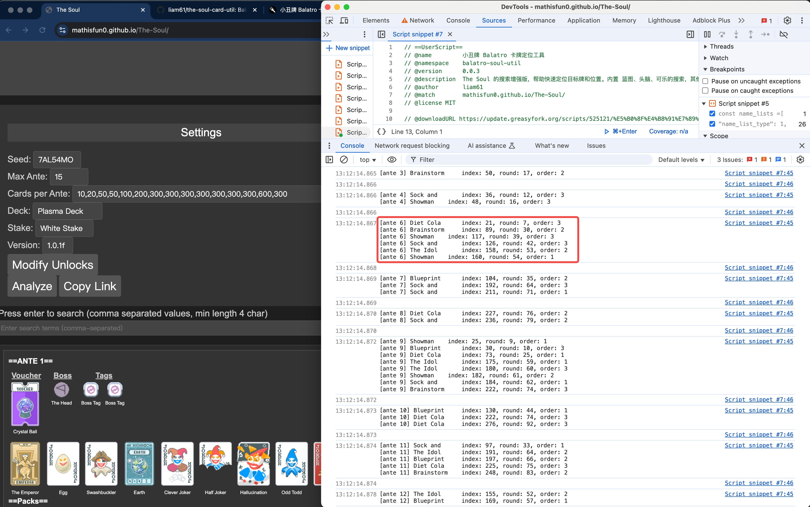
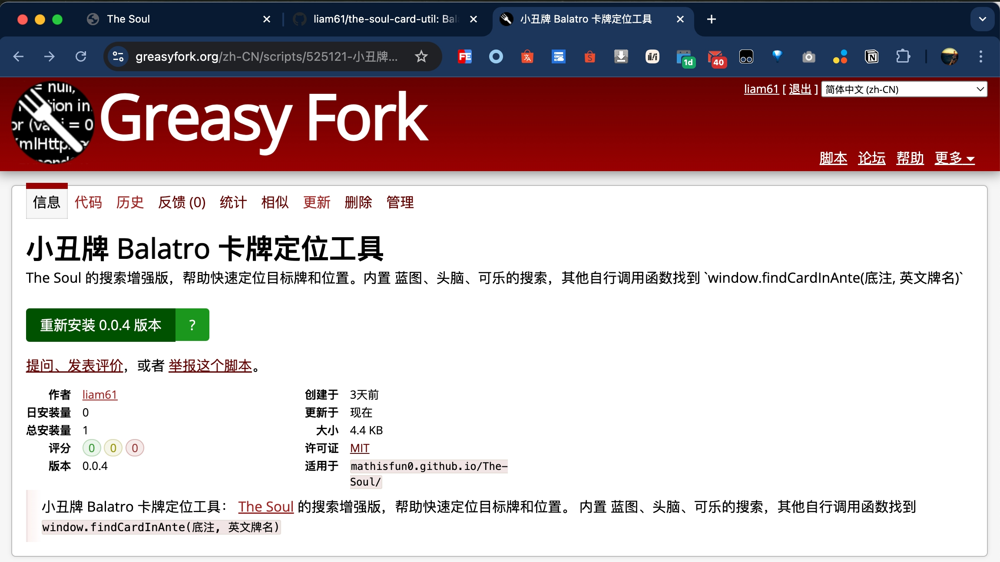

# the-soul-card-util

Balatro: A search util to locate cards for [The-Soul](https://mathisfun0.github.io/The-Soul/) seed analyzer

小丑牌游戏工具：适用于 [The-Soul](https://mathisfun0.github.io/The-Soul/) 站点，帮助快速分析和定位目标卡牌

## 1. Snapshot（示意图）



## 2. Usage（使用方式）

```js
// simple usage
window.findCardsInAllAntes(/* the cards you want to find */)

// or for custom usage
window.findCardsInAnte(6, ['Blueprint', 'Brainstorm', 'Diet Cola'])

// or use preset to find 'HighCard' cards
window.findCardsInAnte(13, null, { preset: 'HighCard' })
```

### 2.1 api

```js
/**
 *
 * @param {number} ante 底注
 * @param {string | string[]} targets 目标牌，可以是单张牌，也可以是多张牌数组
 * @param {object} config
 * @param {'order' | 'card'} config.orderType 排序方式，order: 按照位置顺序，card: 按照牌的顺序
 * @param {'FlushFive' | 'HighCard'} config.preset 预设的牌组，FlushFive: 同花五条流，HighCard: 高牌流
 * @param {2 | 3 | 4} config.stockSize 牌库大小，默认 3
 */
const findCardsInAnte = (ante, targets = [], config) => {}
```

## 3. Tampermonkey Extension（油猴插件）

use for website [The-Soul](https://mathisfun0.github.io/The-Soul/)

[小丑牌 Balatro 卡牌定位工具](https://greasyfork.org/zh-CN/scripts/525121-%E5%B0%8F%E4%B8%91%E7%89%8C-balatro-%E5%8D%A1%E7%89%8C%E5%AE%9A%E4%BD%8D%E5%B7%A5%E5%85%B7)



## 4. Declaration（声明）

LICENSE: MIT，引用请说明出处
